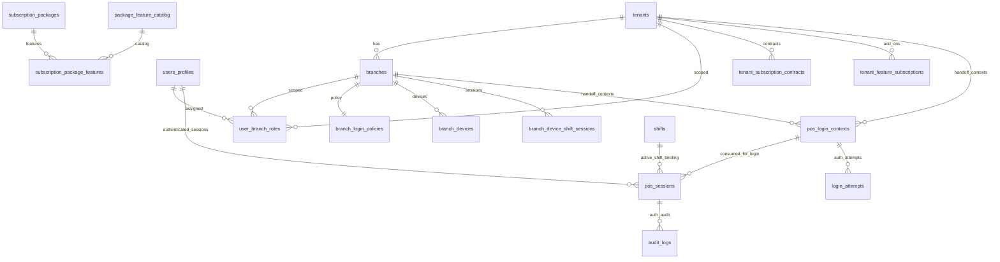

> [!WARNING]
> ARCHIVED (2026-05-31): This document references legacy QR login flow and is kept for historical/audit context only.
> Active runtime flow: apps/backoffice-web `/login/store -> /login/branches|employee -> /login/devices`.
> See: `docs/ARCHIVE-QR-DECOMMISSION-2026-05-31.md`.
# SST iPOS Multi-Owner + Multi-Branch Architecture

## Scope
- Support multi-tenant (many store owners).
- Support multiple branches per tenant.
- Support secure login handoff from store code/branch selection to scan verification.
- Support branch-level policy and device constraints.
- Support package + feature gating at tenant/branch scope.

## System Surfaces
1. `pos.<domain>`: POS selling workflow (PWA, role-based menu access).
2. `id.<domain>`: staff access gateway (store code -> branch -> QR/PIN/card login).
3. `admin.<domain>`: IT/backoffice operations.
4. `www.<domain>`: product site + registration + package configuration.

## Core Data Model

## Secure Login Handoff (Current)
### Step 1: Resolve store code
- Client calls `/api/store/resolve` with `store_code`.
- Server returns tenant summary + active branches + policy preview.

### Step 2: Select branch and create secure context
- Client calls `/api/store/login-context` with:
  - `store_code`
  - `branch_id`
- Server resolves `device_code` from secure cookie (`POS_DEVICE_CODE_COOKIE_NAME`) when available.
- Client-provided `device_code` is treated as untrusted metadata only (not trusted identity).
- Server validates:
  - tenant exists and is active
  - branch exists, is active, and belongs to tenant
- Server inserts a short-lived row in `pos_login_contexts` and returns:
  - `login_context_id`
  - `expires_at`

### Step 3: Redirect to scan
- Client redirects to `/scan?ctx=<login_context_id>`.
- Raw `tenant_id`/`branch_id`/`store_code` are not passed in URL anymore.

### Step 4: Server-side context validation in `/scan`
- Server loads `ctx` from `pos_login_contexts`.
- Validates:
  - context exists and status is active
  - context not expired
  - tenant exists and active
  - branch exists, active, and belongs to tenant
  - branch policy exists
- Device validation (`branch_devices`) based on context `device_code`:
  - if policy `require_registered_device=true` and `device_code` missing -> block (`missing_device`)
  - if code not found -> block (`unregistered_device`)
  - if code exists under other tenant -> block (`device_tenant_mismatch`)
  - if code exists under same tenant but other branch -> block (`device_branch_mismatch`)
  - if device inactive/non-active -> block (`inactive_device` / `device_not_allowed`)
  - if policy blocks shared/unlocked devices -> block (`device_policy_blocked`)
  - when valid -> update `branch_devices.last_seen_at`
- If invalid: render explicit error state.
- If valid: render allowed login method placeholders from policy flags.

## Real Authentication + Session Flow (Current)
1. Client sends only `ctx` to verify endpoint (`/api/auth/qr/verify`, `/api/auth/pin/verify`, `/api/auth/staff-card/verify`).
2. Server re-validates `ctx` + tenant + branch + policy + device (no trust from client identifiers).
3. Server verifies login method:
   - QR: `pos_qr_login_tokens` with hashed token secrets (`token_hash`) and lifecycle status (`active|used|expired|revoked`).
   - PIN: secure hash compare (`users_profiles.pin_hash` via bcrypt compare).
   - Staff card: `pos_staff_cards` with hashed card secrets (`card_hash`) and lifecycle status (`active|inactive|lost|revoked`).
4. Server validates active `users_profiles` + `user_branch_roles` for tenant+branch role.
5. Server creates `pos_sessions` row (scoped to tenant/branch/device/user/method).
6. Server consumes `pos_login_contexts` (`status='consumed'`, `consumed_at=now()`).
7. Server logs:
   - `login_attempts` (success/fail with reason + request metadata).
   - `audit_logs` (`pos_login_<method>_success`).
8. Server sets HttpOnly handoff cookie and returns safe POS redirect target (no sensitive query params).

## Session + Audit Tables
- `pos_sessions`:
  - scoped fields: `tenant_id`, `branch_id`, `device_id/device_code`, `user_id`, `role`, `login_context_id`, `login_method`, `status`.
  - security controls: login method/status checks, active-session uniqueness guardrails, tenant/branch indexes, RLS enabled.
- `login_attempts`:
  - tracks failed/success authentication attempts and reason codes.
- `audit_logs`:
  - reused existing table, extended with POS login-friendly fields (`target_user_id`, `device_code`, `pos_session_id`, `target_type`, `old_value`, `new_value`).

## Shift Check-in Gate (Current)
1. POS app entry calls `GET /api/pos/session/current`.
2. If no valid `pos_session`, app shows login required and links back to ID app.
3. If session exists but no active shift:
   - show gate screen
   - `POST /api/pos/shifts/open` (open new shift)
   - `POST /api/pos/shifts/join` (join existing open shift)
4. When shift is active, POS app can enter sales shell.
5. `POST /api/pos/shifts/close` closes shift and clears `pos_sessions.shift_id` for active sessions in scope.

## Shift Model Normalization
- Reuse `shifts` as source of truth (do not delete existing tables).
- Keep `branch_device_shift_sessions` for historical/device session use-cases; no destructive changes in this phase.
- Added/normalized fields:
  - `device_code`
  - `closing_cash`
  - `metadata`
  - `updated_at`
  - `status` supports `open | closed | suspended`
- `pos_sessions.shift_id` remains nullable but enforced by API gate for sales entry.

## API Guard Requirements
- New server guard utility:
  - `requirePosSession()`
  - `requireActiveShift()`
  - `requirePermission(permission)`
  - `getTenantBranchScopeFromSession()`
- Future order/payment APIs must use these guards to enforce session+shift scope server-side.

## POS Sales MVP Flow (Current)
1. POS entry passes shift gate (`pos_session` + active shift).
2. Product menu loads from `GET /api/pos/products` (session scope only).
3. Cashier adds products to cart, adjusts quantity, sets optional discount.
4. Checkout calls `POST /api/pos/orders`:
   - server recalculates totals from DB prices (client totals are ignored)
   - creates order + order items in transactional RPC (`app.create_pos_order_tx`)
   - binds `device_code`, `pos_session_id`, `cashier_user_id`, `shift_id`
   - writes `order_created` / `order_failed` audit logs.
5. Payment calls `POST /api/pos/orders/:id/pay`:
   - validates order is in same tenant + branch + active shift
   - creates payment in transactional RPC (`app.complete_pos_payment_tx`)
   - marks order paid/completed, updates payment/order scope metadata
   - writes `payment_created` and `order_paid` audit logs.
6. Current shift history loads from `GET /api/pos/orders/current-shift`.

## POS Sales MVP Schemas (Normalized)
- Reused existing core tables and normalized for POS session scope:
  - `products`: added `metadata`
  - `orders`: added `device_code`, `cashier_user_id`, `pos_session_id`, `tax_total`, `grand_total`, `paid_total`, `metadata`, `updated_at`
  - `order_items`: added `name`, `metadata`
  - `payments`: added `shift_id`, `pos_session_id`, `status`, `metadata`
- Added scope/performance indexes for:
  - tenant + branch + shift + created_at
  - order_id lookup
  - pos_session_id lookup
  - device/cashier lookup

## POS Sales MVP API Contracts
- `GET /api/pos/products`
  - requires active session + active shift
  - returns active products for current session scope.
- `POST /api/pos/orders`
  - requires active session + active shift + `sale:create`
  - input: `items[]`, optional `discount_total`
  - server computes totals and creates order atomically.
- `POST /api/pos/orders/:id/pay`
  - requires active session + active shift + `sale:create`
  - validates order scope and remaining due
  - creates payment and marks order paid.
- `GET /api/pos/orders/current-shift`
  - requires active session + active shift
  - returns only orders from current active shift.

## Attendance Real-time (Owner/Manager in POS Screen)
### Attendance Schemas
- `staff_attendance_records`
  - per-user per-day attendance status and timestamps (`checked_in`, `late`, `absent`, `on_leave`, `checked_out`, etc.)
  - tenant+branch+user+date unique key
- `staff_leave_requests`
  - leave request lifecycle (`pending`, `approved`, `rejected`, `cancelled`)
- `staff_attendance_events`
  - immutable event log for check-in/check-out/manual changes, including `device_code`, `shift_id`, `pos_session_id`

### Permission Model
- `attendance:view_self`
  - staff/manager/owner can view own attendance record.
- `attendance:view_all_branch`
  - manager/owner can view branch staff attendance summary/list.
- `attendance:manage`
  - manager/owner can set manual statuses in branch scope.
- `attendance:override`
  - owner-level override (reserved for stricter flows/export/approvals).
- `attendance:export`
  - owner-level export/reporting hook (future).

### Role Behavior
- owner:
  - same POS Sales screen as manager/staff
  - can view/manage attendance in current branch scope, and can extend to all allowed branches via existing branch-role model.
- manager:
  - same POS Sales screen
  - can view/manage branch staff attendance.
- staff:
  - same POS Sales screen
  - can view/check-in/check-out self only (no full staff list).

### Attendance APIs
- `GET /api/pos/attendance/status`
  - active session required
  - staff gets self-only status
  - manager/owner gets branch summary + staff list
  - summary: `checkedIn`, `late`, `absent`, `onLeave`
- `POST /api/pos/attendance/check-in`
  - active session required
  - upserts today's self attendance, emits event + audit log
- `POST /api/pos/attendance/check-out`
  - active session required
  - updates today's self attendance, emits event + audit log
- `POST /api/pos/attendance/manual-status`
  - `attendance:manage` required
  - manager/owner can set `on_leave`, `absent`, `late`, `checked_in` with note
  - optional leave request approve/reject linkage
  - emits event + audit log

### Real-time Behavior
- Current implementation: safe polling fallback (`/api/pos/attendance/status`) every ~20 seconds from POS Sales screen.
- Polling scope:
  - current session tenant + branch only
  - current day only
- Realtime subscription (Supabase Realtime) can be added later using the same strict scope filters.

### POS UI Placement
- Compact attendance summary in sales header:
  - `Staff: checked in X | late Y | leave Z | absent N`
- `View details` opens attendance drawer/modal:
  - summary cards
  - filter tabs (`all`, `checked_in`, `late`, `on_leave`, `absent`)
  - staff list
  - manager actions (manual status update) only when permitted
- Attendance widget is intentionally compact to avoid cluttering sales workflow.

## Backoffice/Admin Operations (Current)
### Route Scope
- Added platform admin routes:
  - `/tenants`
  - `/tenants/[tenantId]/branches`
  - `/tenants/[tenantId]/users`
  - `/tenants/[tenantId]/devices`
  - `/tenants/[tenantId]/login-policies`
  - `/tenants/[tenantId]/sessions`
  - `/tenants/[tenantId]/shifts`
  - `/tenants/[tenantId]/features`
  - `/audit-logs`

### Admin API Scope
- Added IT-admin protected APIs under `api/it-admin/admin/*`.
- All mutation routes require `platformRole=it_admin`.
- Tenant owner/manager/staff cannot access platform-only controls by default.

### Operational Workflows
- Tenant/branch administration:
  - list tenants, view branch counts, view active POS session counts.
  - create/update branches in tenant scope.
- User + branch role administration:
  - list role assignments
  - assign owner/manager/staff per branch
  - deactivate assignment (remove mapping)
  - prevent duplicate assignment for same tenant+branch+user.
- Device administration:
  - list devices by tenant/branch
  - approve/activate/deactivate/block
  - expose `lock_mode` from `is_locked`
  - expose `last_seen_at`.
- Login policy administration:
  - update `require_registered_device`, `require_qr_login`, `allow_pin_login`, `allow_staff_card_login`, `allow_multi_device` (mapped to `allow_shared_devices`), `max_devices`.
- Session/shift administration:
  - list POS sessions and revoke unsafe active sessions
  - list shifts and force close/suspend when needed.
- Feature subscriptions:
  - list feature catalog + tenant override state
  - enable/disable tenant (or branch-scoped) feature overrides.
- Audit logs:
  - filter by tenant, branch, actor, action, date range.
  - all admin mutations write audit logs.

## Subscription / Package / Feature Gate (Current)
### Canonical Subscription Model (Reused)
- `subscription_packages` (plan catalog)
- `subscription_package_features` (plan feature matrix)
- `tenant_subscription_contracts` (tenant contract + status)
- `tenant_feature_subscriptions`:
  - `branch_id is null` = tenant feature override
  - `branch_id is not null` = branch feature override

### Compatibility Layer
- Added compatibility SQL views for operational readability:
  - `plans`
  - `plan_features`
  - `tenant_contracts`
  - `feature_subscriptions`
  - `branch_feature_overrides`
- Existing canonical tables remain the source of truth.

### Feature Resolution Order
1. latest tenant contract must be `active` or `trial` (and not expired by `ended_at`)
2. base feature from plan (`subscription_package_features.included`)
3. tenant override from `tenant_feature_subscriptions` where `branch_id is null`
4. branch override from `tenant_feature_subscriptions` where `branch_id = current branch`

### Quota Enforcement
- Contract limits resolved from:
  - `max_branches` fallback `branch_limit`
  - `max_devices` fallback `terminal_limit_per_branch`
  - `max_users` (or metadata fallback)
- Runtime enforcement:
  - branch creation -> `max_branches`
  - device approve/activate -> `max_devices`
  - user assignment (new user in tenant scope) -> `max_users`
- When blocked, API returns `quota_blocked` and writes `quota_blocked` audit log.

### API Enforcement Rules (Server-side)
- QR login verify requires feature `qr_login`.
- PIN login verify requires feature `pin_login`.
- Staff-card login verify requires feature `staff_card_login`.
- Attendance APIs require feature `attendance_tracking`.
- Device management APIs require feature `device_management`.
- Branch creation requires feature `branch_management`.
- User role assignment requires feature `user_management`.
- POS sales APIs require feature `core_pos_sales`.
- All checks are server-side; UI hide/show is not trusted as security control.

### Contract and Feature Operations
- IT admin can:
  - select/replace tenant plan
  - update contract status (`trial|active|suspended|expired|cancelled`)
  - tune branch/device/user limits
  - enable/disable tenant or branch feature overrides
- Audit events:
  - `plan_changed`
  - `feature_enabled`
  - `feature_disabled`
  - `quota_blocked`
  - `contract_suspended`
  - `contract_reactivated`

## Security Notes
- No service role key is exposed to client.
- All sensitive validation happens on server routes/pages.
- URL query only carries opaque short-lived context ID.
- Context is tenant/branch scoped and validated again at scan stage.
- Device trust is server-side only via `branch_devices` + branch policy.
- Replay protection:
  - consumed `ctx` is rejected (`context_consumed` / `context_replay_detected`).
  - duplicate use after successful auth revokes/blocks unsafe re-issuance.
- Sales security notes:
  - no trusted `tenant_id`/`branch_id` from client payloads
  - order/payment scope is always derived from `pos_session`
  - totals are calculated server-side from DB prices.
  - attendance APIs derive scope from `pos_session` and enforce role-based visibility.

## Final Hardening Summary (Prompt 8)
### Rate limiting
- Added server-side rate limiting for public/security-sensitive login endpoints:
  - `POST /api/store/resolve`
  - `POST /api/store/login-context`
  - `POST /api/auth/qr/verify`
  - `POST /api/auth/pin/verify`
  - `POST /api/auth/staff-card/verify`
- Keys:
  - by IP address (all listed routes)
  - by `device_code` where available (auth verification and login-context flow)
- Behavior:
  - returns `429 rate_limited`
  - includes `Retry-After` header
  - records excessive auth failures via `login_attempts` and audit events.
  - supports centralized backend via `RATE_LIMIT_BACKEND=upstash|redis`.
  - auth verify routes fail closed in production if centralized backend is unavailable.

### Safe error handling
- Public API responses were hardened to avoid leaking raw SQL/internal error messages.
- Detailed diagnostics remain server-side in logs for incident/debug workflows.

### Audit coverage review
- Covered:
  - login success/fail
  - context consumed success
  - replay attempts
  - device mismatch/device policy rejection
  - session creation failure and revoke on unsafe consume flow
  - shift/order/payment/attendance/admin feature mutations (from previous phases)
- Remaining operational requirement:
  - validate action naming conventions in production SIEM dashboard mapping.

### Performance review notes
- Core scope indexes exist on tenant/branch/session/shift/order/payment tables.
- Login path uses scoped lookups (`ctx`, tenant, branch, policy, device) and short-lived context indexes.
- Attendance real-time uses scoped polling fallback (tenant+branch+today), no broad subscription.
- Admin listing endpoints for logs/sessions/shifts should keep pagination enforced in UI and API.

## Mobile QR Activation/Enrollment Foundation (Phase 1)
### Why this phase exists
- Mobile devices/phones must not become trusted from client-sent identifiers alone.
- Trust is granted only after server-side activation + enrollment lifecycle.

### New data model
- `activation_tokens`
  - token hash only (`token_hash`), never store raw token.
  - lifecycle: `active|consumed|expired|revoked`.
  - tenant scoped, optional branch scope.
- `device_enrollments`
  - tracks device identity, enrollment status, and trust level.
  - lifecycle:
    - enrollment status: `pending|active|revoked|blocked`
    - trust level: `untrusted|enrolled|trusted`
- `mobile_device_sessions`
  - authenticated mobile session timeline (`active|expired|revoked`).

### Branch policy extension
- `allow_mobile_qr_login`
- `require_mobile_device_enrollment`
- `allow_mobile_slip_scan` (reserved for separate flow; no slip scan implementation in this phase)

### Phase 1 APIs
- Backoffice/Admin:
  - `POST /api/it-admin/admin/activation-tokens`
  - `GET /api/it-admin/admin/device-enrollments`
  - `POST /api/it-admin/admin/device-enrollments/[id]/approve`
  - `POST /api/it-admin/admin/device-enrollments/[id]/revoke`
- QR login/mobile:
  - `POST /api/mobile/activation/claim`
  - `POST /api/mobile/login/start`
  - `POST /api/mobile/login/verify`

### Security behavior
- Activation tokens are short-lived and one-time.
- Raw token is returned once at creation and never persisted.
- Mobile login start returns opaque context (`ctx`) only.
- Mobile login verify re-validates server-side scope:
  - ctx
  - tenant
  - branch
  - policy
  - enrollment/trust
  - user + user_branch_roles
- Successful verify consumes `ctx` and blocks replay.
- Sensitive actions are rate-limited and audited.

### Flow separation guarantee
- Mobile QR Login (identity/auth) and Mobile Slip Scan (payment evidence) are separate systems.
- Slip scan must use separate APIs and audit actions; it must not reuse login token verification directly.

## Next Build Steps
1. Execute full manual QA checklist and attach release evidence.
2. Run staged rollback + restore drills and capture timings.
3. Execute production evidence checklist (`docs/go-live-evidence-checklist.md`) and attach signoff artifacts.

## Login Pre-entry Route Update (2026-05-26)
### Desktop/tablet terminal flow
- `/login/store` -> verify store code
- `/login/branches` -> select branch (only when multi-branch and not auto-skipped)
- `/login/employee` -> verify employee by code or QR
- `/login/devices` -> select POS device/register
- redirect to existing POS sales route after session handoff

### Mobile QR flow
- `/login/qr-card` -> employee card with short-lived one-time QR token
- `/login/qr-scan` -> scanner UI with camera start and token fallback
- `/login/qr-success` -> verification-success screen before entering POS

### New API contract surface
- `POST /api/auth/store-code/verify`
- `GET /api/auth/branches`
- `POST /api/auth/branches/select`
- `POST /api/auth/employee/verify-code`
- `POST /api/auth/employee/verify-qr`
- `GET /api/auth/devices`
- `POST /api/auth/devices/select`
- `POST /api/auth/qr/create`
- `GET /api/auth/session/context`
- `DELETE /api/auth/session/context`
